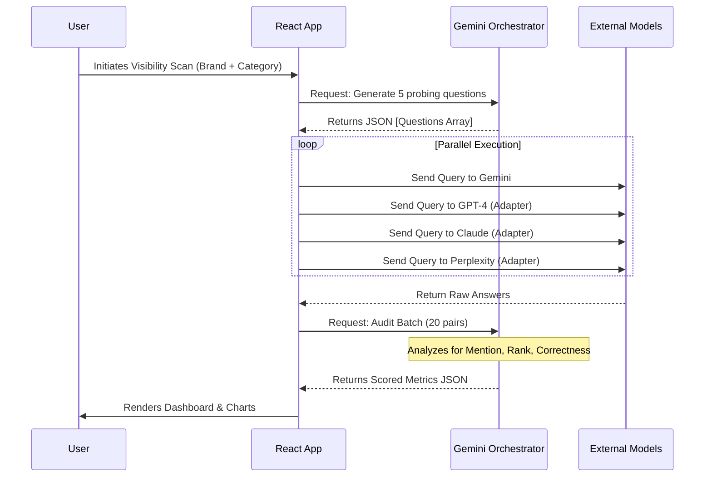

# Stryde | Generative Engine Optimization (GEO) Platform

> **Unlock your Brand's AI Potential.**  
> Stryde is an enterprise-grade dashboard designed to measure, visualize, and optimize brand visibility within Large Language Models (LLMs) and Generative Engines.

---

## 📖 Project Overview

As search behavior shifts from traditional "blue links" to AI-generated answers, brands face a new challenge: **Invisibility**.

Stryde solves this by treating LLMs not as content creators, but as **distribution channels**. It employs a proprietary **AI Visibility Score™** to quantify how often, how highly, and how accurately a brand is cited by major AI models (Gemini, GPT, Claude, Perplexity).

### Core Capabilities
1.  **Multi-LLM Visibility Scanning**: Probes multiple AI engines simultaneously to audit brand presence.
2.  **Semantic Knowledge Graphing**: Visualizes unstructured data as a force-directed graph to detect entity relationship gaps.
3.  **Infrastructure Action Plans**: Generates technical schema (JSON-LD) and vector optimization strategies.
4.  **Hallucination Detection**: automated auditing of AI responses for factual accuracy.

---

##  System Architecture

Stryde is built as a **Client-Side SPA (Single Page Application)** that leverages the **Google Gemini API** as a serverless backend orchestrator.

### High-Level Architecture

```mermaid
graph TD
    User[User / Brand Manager] -->|Interacts| UI[React Frontend (Stryde)]
    UI -->|Orchestration Request| Gemini[Gemini 3 Pro (Orchestrator)]
    
    subgraph "The Intelligence Layer"
        Gemini -->|1. Generate Probes| Probes[User Queries]
        Gemini -->|2. Audit Responses| Audit[Visibility & Accuracy Scoring]
        Gemini -->|3. Generate Code| Code[JSON-LD / Schema Assets]
    end

    subgraph "Multi-LLM Simulation"
        Probes -->|Fetch/Simulate| ModelA[Gemini 3 Pro]
        Probes -->|Fetch/Simulate| ModelB[GPT-4.1]
        Probes -->|Fetch/Simulate| ModelC[Claude 3.5]
        Probes -->|Fetch/Simulate| ModelD[Perplexity Sonar]
    end

    ModelA & ModelB & ModelC & ModelD -->|Raw Responses| Audit
    Audit -->|Calculated Metrics| Dashboard[UI Dashboard]
```

### The Visibility Scan Workflow

The core value proposition is the "Scan." Here is how the technical flow operates:



---

##  Features Breakdown

### 1. The Command Dashboard
A real-time view of your **AI Visibility Score**.
- **Market Share:** Compares your visibility against competitors.
- **Trend Analysis:** Tracks momentum over time (Before/After optimization).
- **Engine Status:** Real-time latency monitoring of connected AI providers.

### 2. Multi-LLM Scanner
The scanner routes prompts to different provider adapters.
- **Orchestrator:** Uses `gemini-3-pro-preview` to judge the output of other models.
- **Output:** A detailed table showing exactly what each model said, flagged for "Hallucinations" or "Inaccuracies."

### 3. Knowledge Graph Engine
A D3-like physics simulation built natively in React.
- **Input:** Accepts unstructured text, CSV, or JSON.
- **Processing:** Extracts entities (Brand, Product, Feature) and relationships.
- **Visualization:** Interactive force-directed graph with clustering capabilities.
- **Goal:** Identify "Orphan Nodes" (concepts not linked to your brand).

### 4. Action Planner
Converts metrics into engineering tasks.
- **Output:** Generates valid code snippets (JSON-LD `schema.org` v26).
- **Priority:** Ranks tasks by "Estimated Lift" (ROI).

---

##  Getting Started

### Prerequisites
*   Node.js (v18+)
*   A Google Cloud Project with the **Gemini API** enabled.
*   (Optional) API Keys for OpenAI, Anthropic, Perplexity if you wish to use real live data for those columns.

### Installation

1.  **Install Dependencies**
    ```bash
    npm install
    ```

2.  **Environment Setup**
    Create a `.env` file (or set system variables):
    ```env
    API_KEY=your_google_gemini_api_key
    # Optional - The app handles missing keys gracefully by skipping or mocking
    OPENAI_API_KEY=sk-...
    ANTHROPIC_API_KEY=sk-ant-...
    PERPLEXITY_API_KEY=pplx-...
    ```

3.  **Run Development Server**
    ```bash
    npm start
    ```

4.  **Build for Production**
    ```bash
    npm run build
    ```

---

## 🛠 Tech Stack

| Component | Technology | Description |
| :--- | :--- | :--- |
| **Frontend** | React 19 | Core UI library. |
| **Styling** | Tailwind CSS | Utility-first styling with custom "Brand/Dark" theme. |
| **AI SDK** | `@google/genai` | Official Google SDK for Gemini models. |
| **Visualization** | Recharts | Area and Bar charts for metrics. |
| **Graphing** | Custom SVG | Custom force-directed graph engine (no heavy D3 dependency). |
| **Icons** | Lucide React | Consistent, lightweight iconography. |

---

##  Design System

Stryde uses a sophisticated "Dark Mode" aesthetic tailored for enterprise dashboards.

*   **Backgrounds:** Deep Slate (`#020617`) with subtle hexagon patterns.
*   **Accents:** "Sand" (`#E3D5C0`) and "Emerald" (`#10b981`) for data visualization.
*   **Typography:** Inter (Sans) for UI, Monospace for code/data artifacts.

---

## 📄 License

Proprietary Demo Software. Created for educational and demonstration purposes regarding AI Distribution Optimization.
